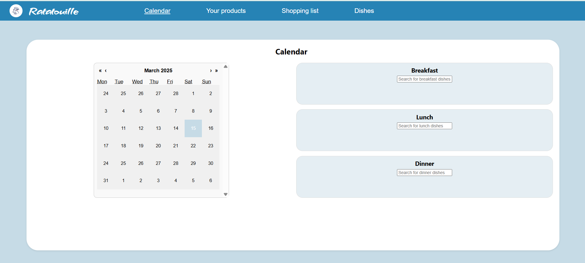
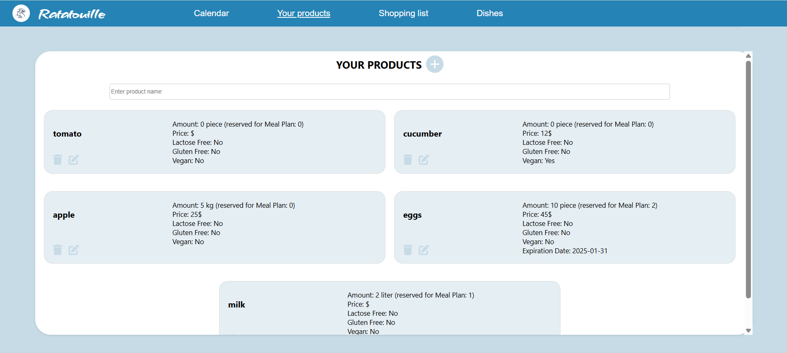

# Menu Planning Web Application - Ratatouille

## Project Description
A web application for menu planning that allows users to:
- Track a list of products at home
- Automatically generate a shopping list
- Plan a monthly menu

## Technologies
- **Frontend:** React  
- **Backend:** Node.js + Express  
- **Database:** MySQL  

## Running the Application Locally
```sh
npm run dev
```
(Run this command in the root directory)

## Authors
 - Maryna Kucher – Calendar and Product List
 - Bilyk Vladyslava – Dishes and Shopping List




